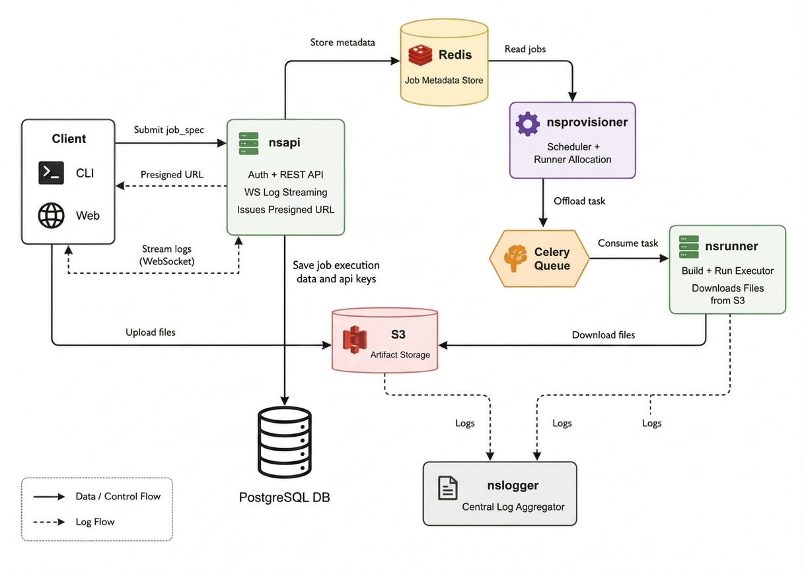

# Northstar CI


Northstar CI is a lightweight self-hosted CI/CD platform designed for developers, homelabs, small teams, and independent projects that need fast, controllable, and transparent automation pipelines without relying on large cloud-based CI providers.

---

## Table of Contents
* [Quick Start](#quick-start)
* [Overview](#overview)
* [Architecture](#architecture)
* [Core Concepts](#core-concepts)
* [Features](#features)
* [Project Status](#project-status)
* [License](#license)

---

## Quick Start

### 1. Create an Account

Visit **nsci.dev** and sign in using:

* GitHub
* GitLab
* Google

After registration, generate and copy your API key.

> API keys are shown only once. Store them securely.

### 2. Install the CLI

```bash
curl -O https://nsci.dev/nssetup.sh
chmod +x nssetup.sh
./nssetup.sh
```

### 3. Authenticate

```bash
nsci login nsk123_xxxxxxxxxxxxxxxxx
```

### 4. Verify Installation

```bash
nsci version
```

### 5. Create a Pipeline

Create a `.northstar/ci.yml` file in your repository root.

See [Pipeline Definition](#pipeline-definition) for the complete YAML specification.

### 6. Run Your First Pipeline

```bash
nsci run .northstar/ci.yml
```

For advanced CLI usage, runner management, deployment workflows, and fully self-hosted deployments, see:

→ `docs/INSTALLATION.md`

---

## Overview

Northstar CI focuses on distributed execution, simple pipeline definitions, and a Bring Your Own Runner (BYOR) philosophy.

Instead of centralizing execution on managed infrastructure, Northstar separates orchestration from execution, allowing runners to operate on user-owned hardware, homelabs, VPS instances, or dedicated machines.

Key goals:

- Simple CI/CD workflows
- Distributed runner architecture
- Self-hostable control plane
- Resource-limited execution
- Matrix build support
- Bring Your Own Runner (BYOR)
- Transparent pipeline definitions

---

## Architecture



Northstar follows a distributed control-plane and runner architecture designed around the Bring Your Own Runner (BYOR) philosophy.

Core services:

| Service | Purpose |
|----------|----------|
| nsapi | API gateway and pipeline submission |
| nsprovisioner | Runner orchestration and job scheduling |
| nsrunner | Build execution and sandbox management |
| nshook | Webhook receiver for repository events |

For a detailed breakdown of the system architecture, service responsibilities, communication patterns, design decisions, and architectural evolution, see:

**Architecture Documentation**  
→ [docs/architecture](docs/architecture)

The architecture documentation covers:

- System overview
- Service responsibilities
- gRPC communication model
- Runner lifecycle
- Job execution flow
- Logging architecture
- Deployment architecture
- BYOR design philosophy
- Architectural revisions and evolution history

---

## Core Concepts

### Bring Your Own Runner (BYOR)

Northstar allows users to contribute their own execution capacity.

Runners establish outbound connections to the orchestration layer and can execute pipelines on:

- Local machines
- Homelabs
- VPS instances
- Dedicated servers

This approach reduces centralized compute requirements while enabling horizontal scaling.

### Distributed Execution

Execution is separated from orchestration.

Control plane responsibilities:

- Pipeline scheduling
- Runner coordination
- Metadata management

Runner responsibilities:

- Build execution
- Test execution
- Deployment execution
- Resource enforcement

### Pipeline Definition

Northstar pipelines are defined using YAML.

Example (repository):

```yaml
version: "0.0.1a"

on:
  push:
    branch: main

jobs:

  limits:
    timeout_seconds: 10
    memory_mb: 256
    cpu_count: 2

  stages:

    - lint:
        runtime: python-3.12
        command: |
          python -m py_compile hudai.py

    - build:
        runtime: python-3.12
        command: |
          cp hudai.py /tmp/build/

    - test:
        runtime: python-3.12
        command: |
          python /tmp/build/hudai.py

    - deploy:
        runtime: alpine
        environment:
          SSH_HOST: "deploy.example.internal"
          SSH_USER: "deployer"
          SSH_PORT: "22"
        command: |
          echo "Deploying build to {environment}"
        steps:
          - scp -r /tmp/build deployer@deploy.example.internal:/opt/northstar/app
          - ssh deployer@deploy.example.internal "cd /opt/northstar/app && docker compose up -d"

```

Example(CLI):
```yaml
version: "0.0.1a"

target: path/to/target

jobs:

  limits:
    timeout_seconds: 10
    memory_mb: 256
    cpu_count: 2

  stages:

    - lint:
        runtime: python-3.12
        command: |
          python -m py_compile hudai.py

    - build:
        runtime: python-3.12
        command: |
          cp hudai.py /tmp/build/

    - test:
        runtime: python-3.12
        command: |
          python /tmp/build/hudai.py

    - deploy:
        runtime: alpine
        environment:
          SSH_HOST: "deploy.example.internal"
          SSH_USER: "deployer"
          SSH_PORT: "22"
        command: |
          echo "Deploying build to {environment}"
        steps:
          - scp -r /tmp/build deployer@deploy.example.internal:/opt/northstar/app
          - ssh deployer@deploy.example.internal "cd /opt/northstar/app && docker compose up -d"

```


## Features
- YAML-based pipelines
- Matrix builds
- Lint stage support
- Build stage support
- Test stage support
- Deploy stage support
- Distributed runners
- Resource limits
- Webhook integration
- CLI submission
- Self-hosted deployment

## Project Status

Northstar CI is currently under active development.

Current focus areas:

- Runner validation
- End-to-end pipeline testing
- Deployment workflows
- Documentation improvements

The architecture and APIs may change before the first stable release.


## License

### GPL License